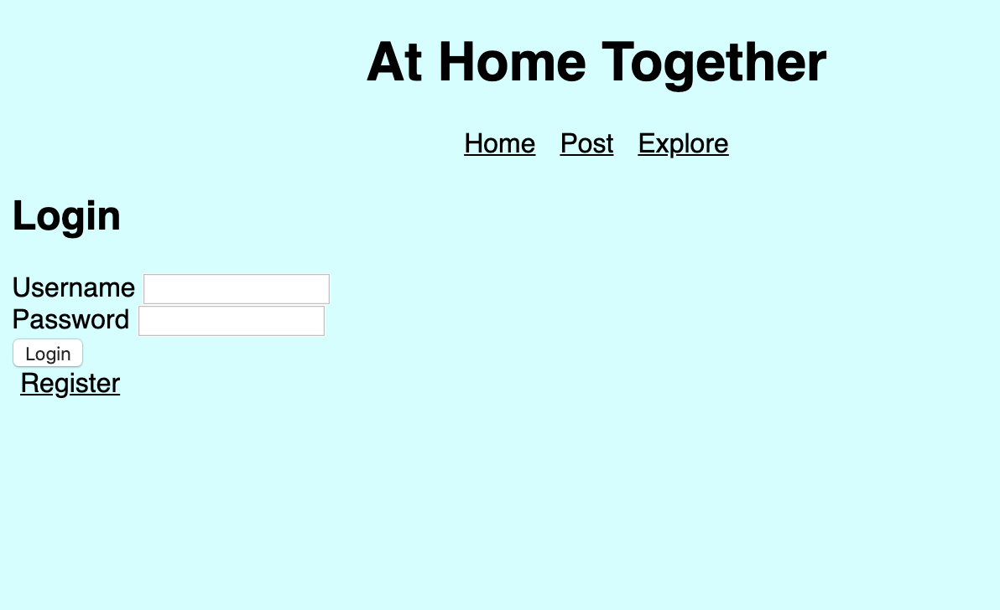
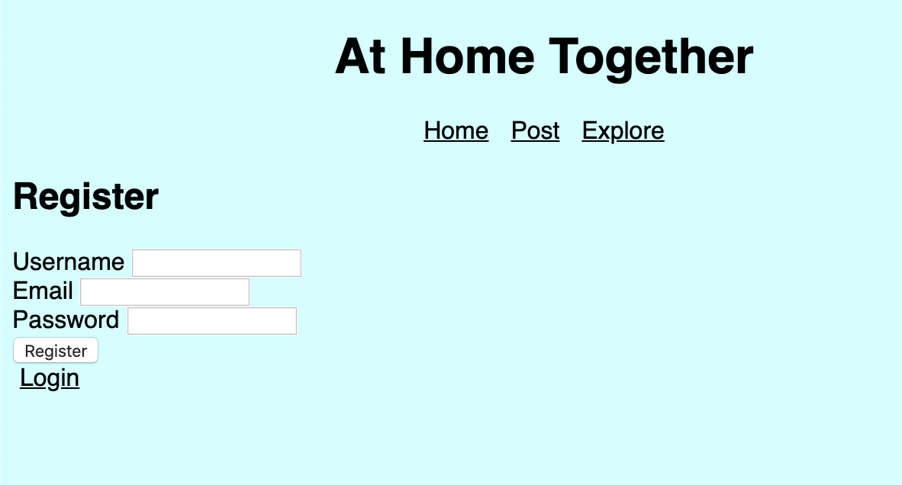

# AtHomeTogether

## Overview

AtHomeTogether is a website to find video group calls to fit your needs-- whether it be a group study session, yoga lessons, or a video call party -- you can browse the explore page on AtHomeTogether to find the right community for you. Have access to video calls 24/7 and meet new friends who share similar interests. Users can register with a username and password so they can save posts, follow people they're interested in, and have easy access to the group call links. 

## Data Model

The application will store users and posts using mongodb

* User Schema Model 
* Post Schema Model


An Example User:

```javascript
{
  username: "here4studdybuddies",
  email: // a password hash,
  password: // an array of group objects representing groups user has joined
}
```

An Example Post:

```javascript
{
  name: "meli",
  post: "looking for study pals from 12pm-3pm EST zoom.com/1234232"
  category: "study"
}
```


## [Link to Commented First Draft Schema](db.js) 

## Wireframes
Although the black and white wireframes weren't created to their full potential, I decided to keep them here. 

/home - page to see posts by people in the groups you're a part of


/explore - page for seeing active group calls and exploring other groups to join


/post - page to submit form to post group call link to groups


/login - before you can see home 


/register - option provided beneath login form 



## Site map
                  


## User Stories or Use Cases

1. as non-registered user, I can register a new account with the site
2. as a non-registered and registered user, I can browse explore page to see posts and make posts
3. as a registered user, I can log in to the site 
4. as a user, I can make posts and browse explore page
Not implemented/To Do Still: 
5. as a user, I can view the list of groups I'm a part of and see recent posts related to those groups

## Research Topics

* (5 points) Integrate user authentication
    * I'm going to be using passport for user authentication
    * user has option to register. user + their info (hashed) is saved into mongo database. they then have the option to log in and ideally will be told if there was an error.  
    
    (Not Implemented)
* (3 points) Perform client side form validation using JavaScript library (https://validatejs.org/)
    * errors integrated into the DOM w/ error messages

* (1-2 points) Use a CSS framework throughout site 
    * Using Bootstrap 
    * https://bootstrapmade.com/demo/MyPortfolio/ inspiration 

9-10 points total out of 8 required points 
I completed 6-7 points 

## [Link to Initial Main Project File](app.js) 

## Annotations / References Used

1. [passport.js authentication docs](http://passportjs.org/docs)(https://www.youtube.com/watch?v=-RCnNyD0L-s) - Source Code Inspired On This: https://github.com/nyu-csci-ua-0480-008-spring-2020/MelindaCardenas-final-project/blob/2aade6bfe723c9679b4720b613f53c3eb4da26ce/passport-config.js#L1-L34  
Edits were made to make it work with mongo db

2. http://www.passportjs.org/packages/passport-local/

3. AIT Classes on mongodb

4. Debugging E11000 duplicate key error collection - lots of links on google. most helpful one was from https://github.com/Automattic/mongoose/issues/2471


