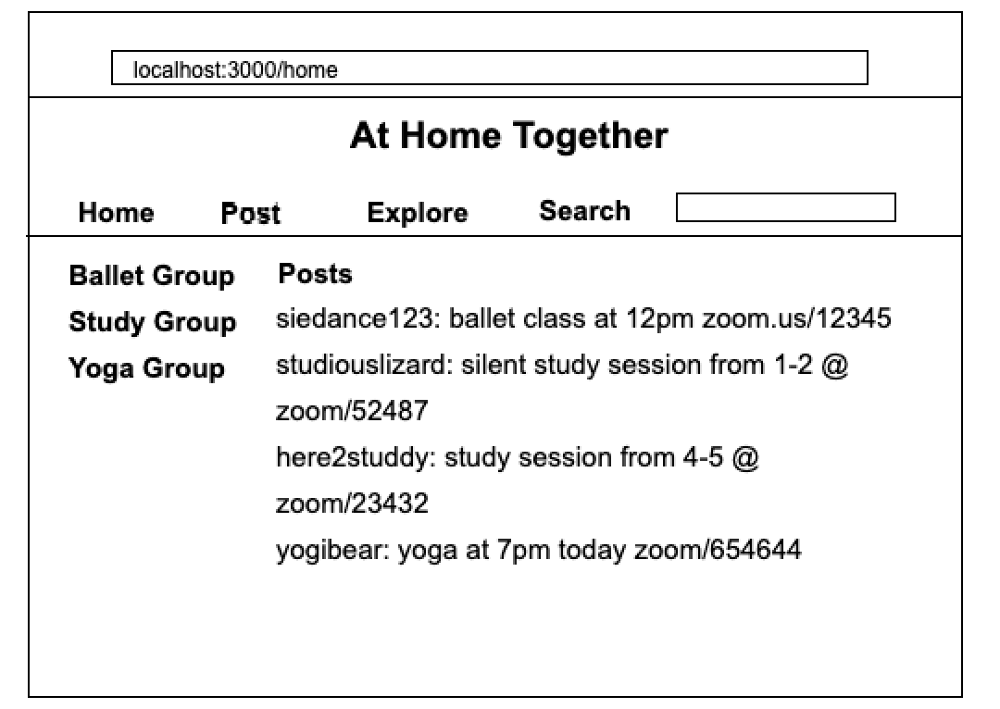
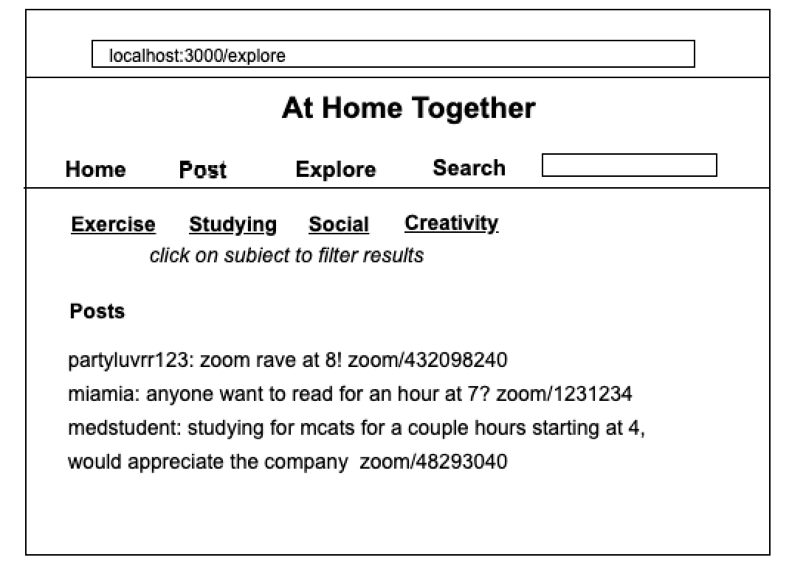
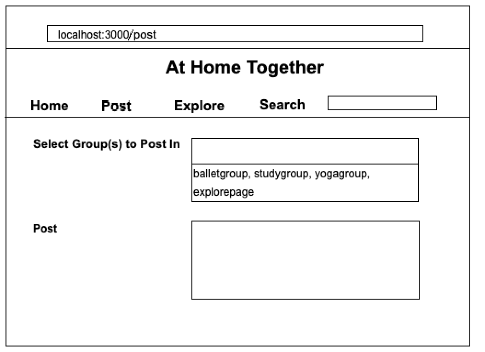
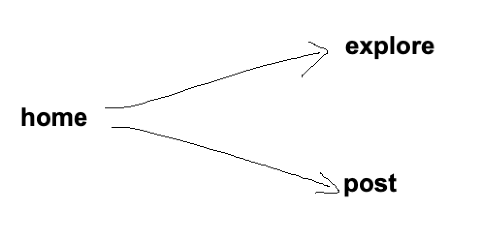

# AtHomeTogether

## Overview

AtHomeTogether is a website to find video group calls to fit your needs-- whether it be a group study session, yoga lessons, or a video call party -- you can use the search engine on AtHomeTogether to find the right community for you. Have access to video calls 24/7 and meet new friends who share similar interests. Users can register with a username and password so they can join the groups they're interested in and have easy access to the group call links. 

## Data Model

The application will store users, list of all groups, and list of groups the user has joined

* users can start a group and add it to the general list of groups (array)
* users will have a list of groups they're following (array)


An Example User:

```javascript
{
  username: "here4studdybuddies",
  hash: // a password hash,
  groupslist: // an array of group objects representing groups user has joined
}
```

An Example Group:

```javascript
{
  name: "StudyGroup",
  icon: //image 
  arrMembers: // an array of user objects representing members
}
```

An Example Group List:

```javascript
{
  arrGroups: //array of all groups
}
```


## [Link to Commented First Draft Schema](db.js) 

## Wireframes

/home - page to see posts by people in the groups you're a part of



/explore - page for seeing active group calls and exploring other groups to join



/post - page to submit form to post group call link to groups



## Site map
                  


## User Stories or Use Cases

(___TODO__: write out how your application will be used through [user stories](http://en.wikipedia.org/wiki/User_story#Format) and / or [use cases](https://www.mongodb.com/download-center?jmp=docs&_ga=1.47552679.1838903181.1489282706#previous)_)

1. as non-registered user, I can register a new account with the site
2. as a user, I can log in to the site
3. as a user, I can create a new grocery list
4. as a user, I can view all of the grocery lists I've created in a single list
5. as a user, I can add items to an existing grocery list
6. as a user, I can cross off items in an existing grocery list

## Research Topics

(___TODO__: the research topics that you're planning on working on along with their point values... and the total points of research topics listed_)

* (5 points) Integrate user authentication
    * I'm going to be using passport for user authentication
    * And account has been made for testing; I'll email you the password
    * see <code>cs.nyu.edu/~jversoza/ait-final/register</code> for register page
    * see <code>cs.nyu.edu/~jversoza/ait-final/login</code> for login page
* (4 points) Perform client side form validation using a JavaScript library
    * see <code>cs.nyu.edu/~jversoza/ait-final/my-form</code>
    * if you put in a number that's greater than 5, an error message will appear in the dom
* (5 points) vue.js
    * used vue.js as the frontend framework; it's a challenging library to learn, so I've assigned it 5 points

10 points total out of 8 required points (___TODO__: addtional points will __not__ count for extra credit_)


## [Link to Initial Main Project File](app.js) 

(___TODO__: create a skeleton Express application with a package.json, app.js, views folder, etc. ... and link to your initial app.js_)

## Annotations / References Used

(___TODO__: list any tutorials/references/etc. that you've based your code off of_)

1. [passport.js authentication docs](http://passportjs.org/docs) - (add link to source code that was based on this)
2. [tutorial on vue.js](https://vuejs.org/v2/guide/) - (add link to source code that was based on this)

